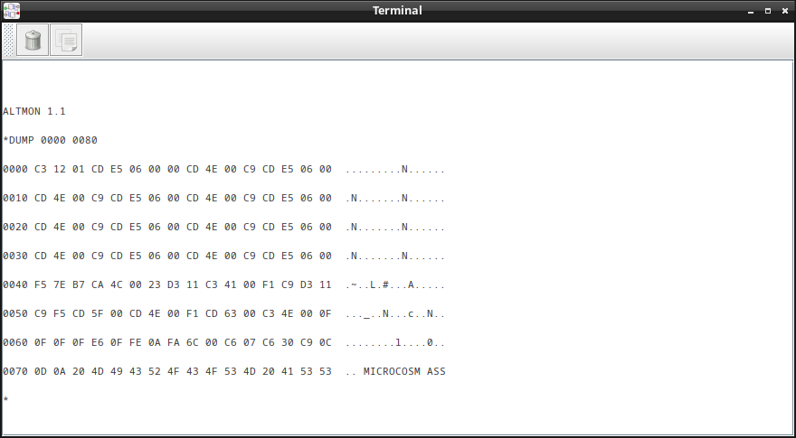

# SAP-8080
Microcoded 8080 like CPU in Digital. Based on https://eater.net/8bit/ and the following SAP-2 and SAP-3 versions.

## Requirements
* Microcode generation requires mcasm: https://github.com/alexiosc/mcasm
* Simulation requires: https://github.com/hneemann/Digital
## Running
Start Digital, load SAP-8080.dig and press "play".
  
Now you should see the [ALTMON](Doc/Altair%20Monitor.pdf) prompt.

Type 'b' to boot into CP/M 2.2
